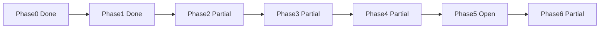

**Audit vs your walkthrough:** the “all phases completed” claim is not accurate. The plan is updated to match what’s on disk.

### Verified done

- **Phase 0:** Dead deps/files gone; JSDoc/`jsconfig` in place
- **Phase 1:** Three-layer tokens, Inter, ThemeProvider + ToastProvider, `components.json`
- **Phase 2 (scaffold):** atoms / molecules / organisms / templates + re-export shims
- **Phase 3 (mostly):** `services/` gone; domain logic in `modules/`
- **Phase 4 (partial):** home, login, dashboard, admin lists extracted
- **Phase 6 (partial):** README architecture present

### Blockers / gaps (now detailed as R1–R6)

1. **`getDashboardStats` is a circular re-export** — dashboard is broken until the real implementation is restored in `modules/admin/admin.service.js`
2. **Product/blog form routes still import deleted `ProductForm` / `BlogForm`** — feature files exist but routes aren’t wired
3. Most **public pages still fat** under `app/` (about, contact, products, blog, certificates, privacy)
4. **Settings** still colocated; **duplicate Toasters** still mounted
5. **Phase 5 not done** — shim folders (`ui`/`layout`/`admin`) still present; no parity gate
6. Missing **`components/atoms/README.md`**

The plan now mirrors your walkthrough style: **Accomplishments** (facts) → **Remaining work R1–R6** (file-by-file) → **Definition of done**, with parity still non-negotiable.

Say when you want execution to continue from **R1 blockers**.

---

name: FAANG UI Refactor
overview: Mid-migration status after audit. Phases 0–1 largely done; Phase 2–3 mostly done with critical gaps; Phase 4 partial (broken admin forms); Phase 5–6 incomplete. Finish remaining structure with strict UI/UX and functionality parity — no redesign.
todos:

- id: phase-0-dead-code
  content: "DONE: zustand/tanstack/store/useDisplayMode/SVGs/refactor-theme/blog.model removed; jsconfig checkJs + aliases; lib/types.js"
  status: completed
- id: phase-1-tokens
  content: "DONE: three-layer tokens + base.css; Inter; ThemeProvider+ToastProvider; components.json. REMAINING: remove duplicate page-level Toasters"
  status: completed
- id: phase-2-atomic-ui
  content: "PARTIAL: atoms/molecules/organisms/templates/primitives exist + ui/layout re-export shims. REMAINING: PageShell/HeroShell/etc; product-card/blog-card/breadcrumb; fold FooterYear"
  status: pending
- id: phase-3-modules
  content: "PARTIAL: services/ gone; domain logic in modules. BLOCKER: restore real getDashboardStats in modules/admin (circular re-export today)"
  status: pending
- id: phase-4-pages
  content: "PARTIAL: home/login/dashboard/admin lists migrated. BLOCKER: wire product/blog forms. REMAINING: extract all fat public pages + settings; remove duplicate Toasters"
  status: pending
- id: phase-5-cleanup
  content: "NOT STARTED: delete ui/layout/admin/pwa shims after rewire; parity smoke gate; fix broken admin form imports"
  status: pending
- id: phase-6-docs
  content: "PARTIAL: README architecture present. REMAINING: components/atoms/README.md + document known mid-migration gaps until closed"
  status: pending
  isProject: false

---

# FAANG UI Refactor — Status Walkthrough + Remaining Work

## Locked decisions (unchanged)

- **Language:** JavaScript + JSDoc (no TypeScript).
- **Scope:** Public + admin.
- **Parity (non-negotiable):** UI/UX and functionality stay intact — structural refactor only.
- **Stack:** Next.js 16 App Router, React 19, Tailwind v4, next-themes, CVA, Radix Slot, own-the-source components.
- **Architecture:** Atomic Design layers + `features/` + `modules/`; thin `app/` routes. Not full FSD rename.

## Audit verdict (verified on disk)

The claim “all phases completed” is **false**. The repo is in a **mid-migration** state: foundation is strong; several Phase 4/5 items are unfinished; at least one **runtime blocker** exists (admin dashboard stats + admin form route imports).



---

## Accomplishments (what is actually done)

### Phase 0 — Dead code and hygiene — DONE

| Item                                                                         | Evidence                                                                                             |
| ---------------------------------------------------------------------------- | ---------------------------------------------------------------------------------------------------- |
| Removed `zustand`, `@tanstack/react-table`                                   | Absent from [`package.json`](package.json)                                                           |
| Removed empty `store/`                                                       | Folder absent                                                                                        |
| Removed `hooks/useDisplayMode.js`                                            | Absent; no references                                                                                |
| Removed create-next-app SVGs / `refactor-theme.mjs`                          | Absent                                                                                               |
| Removed duplicate [`modules/blog/blog.model.js`](modules/blog/blog.model.js) | Absent; [`models/BlogPost.js`](models/BlogPost.js) remains source of truth                           |
| JSDoc tooling                                                                | [`jsconfig.json`](jsconfig.json) has `checkJs` + path aliases; [`lib/types.js`](lib/types.js) exists |

### Phase 1 — Three-layer theme — DONE (one leftover)

| Item          | Evidence                                                                                                                                                                                           |
| ------------- | -------------------------------------------------------------------------------------------------------------------------------------------------------------------------------------------------- |
| Token split   | [`styles/tokens/primitives.css`](styles/tokens/primitives.css), [`semantic.css`](styles/tokens/semantic.css), [`component.css`](styles/tokens/component.css), [`styles/base.css`](styles/base.css) |
| Entry         | [`app/globals.css`](app/globals.css) is import + `@theme inline` only (not monolithic)                                                                                                             |
| Fonts         | Inter via `next/font` in [`app/layout.jsx`](app/layout.jsx) (parity preserved)                                                                                                                     |
| Providers     | [`ThemeProvider.jsx`](components/providers/ThemeProvider.jsx) + [`ToastProvider.jsx`](components/providers/ToastProvider.jsx) mounted in root layout                                               |
| shadcn config | [`components.json`](components.json) with `tsx: false`, `ui: "@/components/atoms"`                                                                                                                 |

**Leftover (must finish in Phase 4/5):** duplicate local `<Toaster />` still in contact + several admin feature files (see Phase 5).

### Phase 2 — Atomic UI kit — PARTIAL (scaffolding done)

**Present and in use:**

| Layer               | Path                                                                                                                                                         | Notable files                                                                                           |
| ------------------- | ------------------------------------------------------------------------------------------------------------------------------------------------------------ | ------------------------------------------------------------------------------------------------------- |
| Primitives          | [`components/primitives/slot.jsx`](components/primitives/slot.jsx)                                                                                           | Radix Slot                                                                                              |
| Atoms               | [`components/atoms/`](components/atoms/)                                                                                                                     | button, input, textarea, label, badge, text, icon, spinner, separator, link, theme-toggle + barrel      |
| Molecules           | [`components/molecules/`](components/molecules/)                                                                                                             | form-field, password-input, select, tabs, table, cursor-pagination, load-more, **stat-card**            |
| Organisms           | [`components/organisms/`](components/organisms/)                                                                                                             | navbar, footer, cookie-banner, floating-contact, confirm-modal, admin-sidebar, admin-mobile-nav, pwa/\* |
| Templates           | [`components/templates/`](components/templates/)                                                                                                             | **standard-layout**, **auth-layout**, **admin-shell**                                                   |
| Compatibility shims | [`components/ui/*`](components/ui/), [`layout/*`](components/layout/), [`admin/AdminShell.jsx`](components/admin/AdminShell.jsx), [`pwa/*`](components/pwa/) | Thin re-exports (intentional mid-migrate)                                                               |

**Public chrome already on templates:** [`app/(public)/layout.jsx`](<app/(public)/layout.jsx>) uses `StandardLayoutTemplate` + `@/modules/categories`.  
**Admin chrome:** [`app/admin/(protected)/layout.jsx`](<app/admin/(protected)/layout.jsx>) uses `AdminShellTemplate`.

**Still missing vs original plan (build only if a migration needs them — parity first):**

- Templates: `page-shell`, `hero-shell`, `marketing-section`, `content-prose`, `split-pane`, `admin-page-frame` (today pages still use `.layout-main` CSS class from [`styles/base.css`](styles/base.css))
- Organisms: `product-card`, `blog-card`, `page-header`
- Molecules: `breadcrumb`, `nav-item`
- [`components/layout/FooterYear.jsx`](components/layout/FooterYear.jsx) still a real file (not folded into footer organism)

### Phase 3 — Domain consolidation — PARTIAL (almost done; one blocker)

| Item                             | Status                                                                                      |
| -------------------------------- | ------------------------------------------------------------------------------------------- |
| `services/` directory            | **Gone** (no folder on disk)                                                                |
| `@/services` imports             | **Zero** remaining                                                                          |
| Real logic in modules            | `products`, `categories`, `blog`, `auth`, `media`, `settings` services hold implementations |
| API / pages import `@/modules/*` | Yes for audited routes                                                                      |

**BLOCKER — admin dashboard:**

```1:5:modules/admin/admin.service.js
/**
 * @deprecated Use '@/modules/admin' instead.
 * This file remains for backward compatibility and re-exports from the module.
 */
export { getDashboardStats } from '@/modules/admin';
```

[`modules/admin/index.js`](modules/admin/index.js) re-exports from `./admin.service` → **circular re-export**. No `getDashboardStats` implementation exists elsewhere. [`app/admin/(protected)/page.jsx`](<app/admin/(protected)/page.jsx>) still calls it. **Must restore the previous service implementation into `modules/admin/admin.service.js` before treating Phase 3 complete.**

### Phase 4 — Feature extraction — PARTIAL

**Done (thin routes + features):**

| Route                                                                | Feature                                                                                                                                                         |
| -------------------------------------------------------------------- | --------------------------------------------------------------------------------------------------------------------------------------------------------------- |
| [`app/(public)/page.jsx`](<app/(public)/page.jsx>)                   | [`features/public/home-page.jsx`](features/public/home-page.jsx)                                                                                                |
| [`app/admin/login/page.jsx`](app/admin/login/page.jsx)               | [`features/admin/login-page.jsx`](features/admin/login-page.jsx) + `AuthLayoutTemplate`                                                                         |
| [`app/admin/(protected)/page.jsx`](<app/admin/(protected)/page.jsx>) | [`features/admin/dashboard-page.jsx`](features/admin/dashboard-page.jsx) + `StatCard`                                                                           |
| Admin products/blog/categories **list** pages                        | [`product-list.jsx`](features/admin/product-list.jsx), [`blog-list.jsx`](features/admin/blog-list.jsx), [`category-list.jsx`](features/admin/category-list.jsx) |
| Form files exist in features                                         | [`product-form.jsx`](features/admin/product-form.jsx), [`blog-form.jsx`](features/admin/blog-form.jsx)                                                          |

**BLOCKER — form routes still import deleted colocated files:**

| Broken import                                                                                                   | Fix                                    |
| --------------------------------------------------------------------------------------------------------------- | -------------------------------------- |
| [`products/new/page.jsx`](<app/admin/(protected)/products/new/page.jsx>) `from "../ProductForm"`                | Import `@/features/admin/product-form` |
| [`products/[id]/edit/page.jsx`](<app/admin/(protected)/products/[id]/edit/page.jsx>) `from "../../ProductForm"` | Same                                   |
| [`blog/new/page.jsx`](<app/admin/(protected)/blog/new/page.jsx>) `from "../BlogForm"`                           | Import `@/features/admin/blog-form`    |
| [`blog/[id]/edit/page.jsx`](<app/admin/(protected)/blog/[id]/edit/page.jsx>) `from "../../BlogForm"`            | Same                                   |

**Not migrated (still fat / colocated):**

| File                                                                                                       | Issue                                                  |
| ---------------------------------------------------------------------------------------------------------- | ------------------------------------------------------ |
| [`app/(public)/about/page.jsx`](<app/(public)/about/page.jsx>)                                             | Full UI inline; `.layout-main`                         |
| [`app/(public)/contact/page.jsx`](<app/(public)/contact/page.jsx>)                                         | Full client UI; local `<Toaster />`; raw form controls |
| [`app/(public)/products/page.jsx`](<app/(public)/products/page.jsx>) + `ProductListInfinite.jsx`           | Still under `app/`                                     |
| [`app/(public)/products/[category]/page.jsx`](<app/(public)/products/[category]/page.jsx>)                 | Fat                                                    |
| [`app/(public)/products/[category]/[slug]/page.jsx`](<app/(public)/products/[category]/[slug]/page.jsx>)   | Fat                                                    |
| [`app/(public)/blog/page.jsx`](<app/(public)/blog/page.jsx>) + `BlogListInfinite.jsx`                      | Still under `app/`                                     |
| [`app/(public)/blog/[slug]/page.jsx`](<app/(public)/blog/[slug]/page.jsx>)                                 | Fat                                                    |
| [`app/(public)/certificates/page.jsx`](<app/(public)/certificates/page.jsx>)                               | Fat; still `text-blue-600`                             |
| [`app/(public)/privacy/page.jsx`](<app/(public)/privacy/page.jsx>)                                         | Fat                                                    |
| [`app/offline/page.jsx`](app/offline/page.jsx), root/public error/not-found                                | Not on templates/Button atoms consistently             |
| [`app/admin/(protected)/settings/SettingsClient.jsx`](<app/admin/(protected)/settings/SettingsClient.jsx>) | Still colocated under `app/`; local Toaster            |

**Barrels incomplete:** [`features/public/index.js`](features/public/index.js) exports home only; [`features/admin/index.js`](features/admin/index.js) exports dashboard + login only (lists/forms not in barrel).

### Phase 5 — Cleanup + parity gate — NOT STARTED

- Legacy shim folders [`components/ui`](components/ui), [`layout`](components/layout), [`admin`](components/admin), [`pwa`](components/pwa) still present (ok as temporary; not deleted).
- Duplicate Toasters remain (listed below).
- No evidence in-repo that the full parity smoke checklist was executed.
- Broken form imports contradict “complete.”

### Phase 6 — Docs — PARTIAL

- [`README.md`](README.md) documents `app/`, `features/`, `components/` atomic layers, `modules/`, `styles/tokens/`, and parity rule.
- Missing: [`components/atoms/README.md`](components/atoms/README.md) (dependency rules + JSDoc example).

---

## Remaining work (execute in this order)

Parity rule still applies: lift JSX/classes verbatim; no redesign; no nav IA changes; no contact API rewrite.

### R1 — Fix blockers first (before any more extraction)

**R1.1 Restore `getDashboardStats`**

| File                                                               | Action                                                                                                                                      |
| ------------------------------------------------------------------ | ------------------------------------------------------------------------------------------------------------------------------------------- |
| [`modules/admin/admin.service.js`](modules/admin/admin.service.js) | Replace circular re-export with the **real** previous implementation (stats queries against models). Remove `@deprecated` circular pattern. |
| [`modules/admin/index.js`](modules/admin/index.js)                 | Keep `export { getDashboardStats } from './admin.service'` only after service is real                                                       |
| Verify                                                             | Dashboard page loads with same stat numbers as before migration                                                                             |

**R1.2 Wire admin form routes**

| File                                                                                                       | Change                                                                                                                                                     |
| ---------------------------------------------------------------------------------------------------------- | ---------------------------------------------------------------------------------------------------------------------------------------------------------- |
| [`app/admin/(protected)/products/new/page.jsx`](<app/admin/(protected)/products/new/page.jsx>)             | `import ProductForm from '@/features/admin/product-form'` (keep existing title chrome for parity, or wrap later in `AdminPageFrame` without visual change) |
| [`app/admin/(protected)/products/[id]/edit/page.jsx`](<app/admin/(protected)/products/[id]/edit/page.jsx>) | Same import; keep data fetch                                                                                                                               |
| [`app/admin/(protected)/blog/new/page.jsx`](<app/admin/(protected)/blog/new/page.jsx>)                     | `import BlogForm from '@/features/admin/blog-form'`                                                                                                        |
| [`app/admin/(protected)/blog/[id]/edit/page.jsx`](<app/admin/(protected)/blog/[id]/edit/page.jsx>)         | Same                                                                                                                                                       |
| [`features/admin/index.js`](features/admin/index.js)                                                       | Export list + form components for clean public API                                                                                                         |

### R2 — Finish Phase 2 templates needed by public migrations

Create only what fat pages need; copy existing class strings for parity:

| New template                                 | Replaces                                                           | Used by                                                        |
| -------------------------------------------- | ------------------------------------------------------------------ | -------------------------------------------------------------- |
| `components/templates/page-shell.jsx`        | `.layout-main` wrapper                                             | about, contact, products*, blog*, not-found/error under public |
| `components/templates/hero-shell.jsx`        | Home/products/blog hero outer shells                               | home (refactor), products, blog indexes                        |
| `components/templates/marketing-section.jsx` | Repeated `max-w-[var(--max-width-layout)] mx-auto px-[var(--gap)]` | about, contact                                                 |
| `components/templates/content-prose.jsx`     | Privacy / blog article width                                       | privacy, blog slug                                             |
| `components/templates/admin-page-frame.jsx`  | Repeated admin `h1` + mb-8 chrome                                  | new/edit product/blog, settings                                |

Optional organisms (extract when touching those pages): `product-card`, `blog-card`, `breadcrumb` — only if it does not alter markup classes.

Fold [`FooterYear.jsx`](components/layout/FooterYear.jsx) into [`organisms/footer.jsx`](components/organisms/footer.jsx), then delete layout original after rewire.

### R3 — Finish Phase 4 public + settings migrations (file-by-file)

For each: move UI to `features/public/...`, leave thin `page.jsx` (data + feature). Preserve copy, classes, behavior.

| From                                                                                 | To                                                 | Notes                                                                                                                                                                                                               |
| ------------------------------------------------------------------------------------ | -------------------------------------------------- | ------------------------------------------------------------------------------------------------------------------------------------------------------------------------------------------------------------------- |
| [`about/page.jsx`](<app/(public)/about/page.jsx>)                                    | `features/public/about-page.jsx`                   | `PageShell` + sections; CTAs via `Button asChild` matching current pills                                                                                                                                            |
| [`contact/page.jsx`](<app/(public)/contact/page.jsx>)                                | `features/public/contact-page.jsx`                 | Use Input/Textarea/Select/FormField/Button; **remove local Toaster**; keep fake submit/toast behavior                                                                                                               |
| [`products/page.jsx`](<app/(public)/products/page.jsx>) + `ProductListInfinite.jsx`  | `features/public/products/`                        | Move infinite list; LoadMore molecule already exists                                                                                                                                                                |
| [`products/[category]/page.jsx`](<app/(public)/products/[category]/page.jsx>)        | `features/public/products/category-page.jsx`       |                                                                                                                                                                                                                     |
| [`products/.../[slug]/page.jsx`](<app/(public)/products/[category]/[slug]/page.jsx>) | `features/public/products/product-detail-page.jsx` | Keep JSON-LD                                                                                                                                                                                                        |
| [`blog/page.jsx`](<app/(public)/blog/page.jsx>) + `BlogListInfinite.jsx`             | `features/public/blog/`                            |                                                                                                                                                                                                                     |
| [`blog/[slug]/page.jsx`](<app/(public)/blog/[slug]/page.jsx>)                        | `features/public/blog/blog-post-page.jsx`          | `ContentProse`; keep JSON-LD                                                                                                                                                                                        |
| [`certificates/page.jsx`](<app/(public)/certificates/page.jsx>)                      | `features/public/certificates-page.jsx`            | Keep layout quirks; replace `text-blue-600` with tokenized link **only if** visual match (use existing text-primary/link styles already on site elsewhere — if blue is intentional leave or map to same blue token) |
| [`privacy/page.jsx`](<app/(public)/privacy/page.jsx>)                                | `features/public/privacy-page.jsx`                 |                                                                                                                                                                                                                     |
| [`SettingsClient.jsx`](<app/admin/(protected)/settings/SettingsClient.jsx>)          | `features/admin/settings-client.jsx`               | Thin settings `page.jsx`; remove local Toaster; prefer atoms imports over `@/components/ui`                                                                                                                         |
| offline / error / not-found                                                          | thin + small feature or template                   | Button atoms for CTAs; same labels                                                                                                                                                                                  |

Update [`features/public/index.js`](features/public/index.js) to export all public page features.

### R4 — Remove duplicate Toasters (Phase 1 leftover)

Root [`ToastProvider`](components/providers/ToastProvider.jsx) already mounts. Delete local `<Toaster />` from:

- [`app/(public)/contact/page.jsx`](<app/(public)/contact/page.jsx>) (after move: contact feature)
- [`features/admin/product-list.jsx`](features/admin/product-list.jsx)
- [`features/admin/product-form.jsx`](features/admin/product-form.jsx)
- [`features/admin/blog-list.jsx`](features/admin/blog-list.jsx)
- [`features/admin/blog-form.jsx`](features/admin/blog-form.jsx)
- [`features/admin/category-list.jsx`](features/admin/category-list.jsx)
- [`SettingsClient.jsx`](<app/admin/(protected)/settings/SettingsClient.jsx>) / settings feature

Match ToastProvider options to the richest existing toastOptions (contact’s CSS-var styles) so appearance stays the same.

### R5 — Phase 5 cleanup + parity gate

1. Grep and rewire remaining `@/components/ui/*`, `@/components/layout/*`, `@/components/admin/*`, `@/components/pwa/*` imports to atoms/organisms/templates/providers.
2. Delete shim folders once zero imports remain:
   - `components/ui/`
   - `components/layout/` (after FooterYear fold)
   - `components/admin/`
   - `components/pwa/` re-export shims (keep organisms/pwa as source)
3. Confirm no `@/services` and no circular admin export.
4. **Parity smoke checklist (required):**
   - Public: home, about, contact (submit+toast), products list/category/detail, blog list/detail, certificates, privacy, offline, 404/error
   - Admin: login, **dashboard stats**, products list/create/edit, blog list/create/edit, categories, settings tabs, logout
   - Theme light/dark; PWA prompts still mount
   - Zero intentional visual/copy/IA changes
5. `npm run build` must succeed

### R6 — Phase 6 docs closeout

| Artifact                         | Action                                                                             |
| -------------------------------- | ---------------------------------------------------------------------------------- |
| [`README.md`](README.md)         | Already good; add short “Migration status” only if useful, or remove once complete |
| New `components/atoms/README.md` | Atomic dependency rule (atom↛molecule), JSDoc example, “add a component” steps     |

---

## Explicitly out of scope (still)

- TypeScript migration
- Monorepo / published UI package
- Full FSD `entities/widgets` rename
- Style Dictionary / Figma token CI
- Contact real API, certificates content, nav IA changes
- Visual redesign / new fonts / new palette

---

## Definition of done

Refactor is complete only when:

1. R1 blockers fixed (dashboard stats + form imports)
2. All listed public/admin fat pages live under `features/` with thin `app/` routes
3. Duplicate Toasters gone
4. Legacy `ui`/`layout`/`admin` shim folders deleted
5. Parity smoke checklist passed
6. `components/atoms/README.md` exists
7. UI/UX and functionality unchanged from pre-refactor baselines
